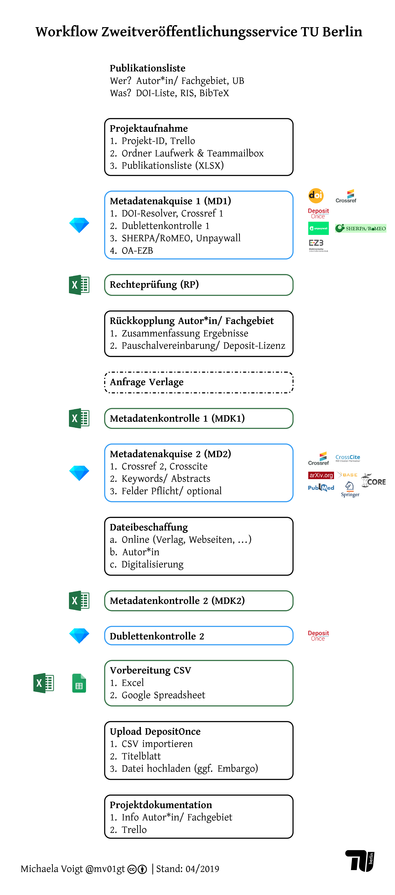

(work in progress!)

## Allgemein

Hier beschrieben ist der teilautomatisierte Workflow des Zweitveröffentlichungsservices an der TU Berlin, der für die Bearbeitung von Publikationslisten von TU-Angehörigen zum Einsatz kommt. Einzelne Beiträge werden als solche behandelt; für diese würde der hier beschriebene Ablauf keinen Zeitgewinn bedeuten.

Mehr zum Hintergrund ist hier zu lesen: Michaela Voigt, Sebastian Dittmann, "Zweitveröffentlichungsservice der TU Berlin – Automatisierungsmöglichkeiten für den Workflow". LIBREAS. Library Ideas, 35 (2019). <https://libreas.eu/ausgabe35/voigt/>



Der Workflow ist modular aufgebaut. Die Automatisierung erfolgt mithilfe von [OpenRefine (OR)](http://openrefine.org/). Voraussetzung für eine erfolgreiche Automatisierung ist das Vorhandensein einer DOI. Der Workflow ist darauf ausgerichtet, dass in Zwischenschritten Spalten nicht umbenannt oder neu angelegt werden. Werden zusätzliche Spalten benötigt, sind Anpassungen in den Skripten erforderlich (insbesondere im Schritt [Spaltenreihenfolge](/1_2_reorder.md)).

Gegenstand der Automatisierung sind die folgenden Aspekte:

* Prüfung, ob die Publikationen bereits im institutionellen Repositorium [DepositOnce](https://depositonce.tu-berlin.de/) vorhanden sind
* Bezug ausgewählter Metadaten via Crossref
* Identifikation von OA-Versionen, die über Verlagswebseiten oder andere Repositorien verfügbar sind, via [Unpaywall](https://unpaywall.org)
* Informationen zu Verlagspolicies via [SHERPA/RoMEO](http://www.sherpa.ac.uk/romeo/) bzw. Informationen zu besonderen OA-Rechten aus Lizenzverträgen via [OA-EZB](https://ezb.ur.de/services/oa-ezb)
* Ausgabe von Excel-Dateien (inklusive Kennzeichnung von Pflicht- bzw. optionalen Feldern) für die weitere manuelle Aufbereitung

Wie ist die vorliegende Dokumentation zu lesen? Der Workflow wird im Grundsatz an dieser Stelle beschrieben; für die automatisierten Schritte liegen separate Dateien vor, welche die eigentlichen OpenRefine-Skripte ("JSON") sowie eine ausführliche Erläuterung der einzelnen Schritte ("Dokumentation zum Code") enthalten.
Diese Erläuterungen sind wie folgt aufgebaut: Allgemeines wird in Listenform aufgeführt. Anweisungen zur Ausführung einzelner Schritte in der graphischen Oberfläche von OpenRefine sind nach dem folgenden Muster aufgebaut:

**DOI** -> Add column by fetching URLs -> **UPW**

* **Wichtig**: `Throttle delay 1000 ms`
* **Wichtig**: `On error: store error`

```
CODE xyz
```

Dabei steht am Anfang (fett markiert) die jeweilige Spalte, für die eine Aktion ausgeführt werden soll; es folgen die Einzelschritte, die über die graphische Oberfläche auszuführen sind (jeweils mit Pfeil markiert). Ist eine neue Spalte anzulegen, ist der erforderliche Spaltenname (fett markiert) angegeben. Sind für die Ausführung weitere Informationen relevant, sind auch diese in Listenform aufgeführt. Darunter folgt der Code-Block, der auszuführen und als solcher formatiert ist. In einigen Fälle werden darunter Beispiele für die zu erwartete Ausgabe in Listenform aufgeführt.

Für eine kurze Einführung in OpenRefine, die hier genutzten Skriptsprachen sowie die wichtigsten Befehle siehe [Intro OpenRefine, GREL, Jython](/intro-OR-GREL-jython.md).


## Schritte im Workflow

Der Workflow ist in verschiedene Module geteilt, für deren Bearbeitung mehrfach zwischen OpenRefine (für die Abfrage von Schnittstellen und Transformation von Metadaten, gekennzeichnet mit '\[OR\]') und Excel (für die manuelle Datenaufbereitung, gekennzeichnet mit '\[E\]') gewechselt wird. Für jedes Modul, das in OpenRefine bearbeitet wird, ist dabei ein separates Projekt anzulegen &mdash; entweder über einen Dateiimport oder über die "Clipboard"-Funktion. Nach Abschluss der Arbeiten in OpenRefine wird das Projekt als XLSX-Datei exportiert und im lokalen Laufwerk abgelegt.

Um den Fortgang des Projektverlaufs und offene Aufgaben zu tracken, wird [Trello](https://trello.com/) genutzt. Jegliche E-Mail-Kommunikation erfolgt über die Teammailbox ([openaccess@ub.tu-berlin.de](mailto:openaccess@ub.tu-berlin.de)) mit CC an die Teammailbox; alle E-Mails werden im jeweiligem Ordner abgelegt.

Der Workflow ist nicht unbedingt linear; etwa die Dateibeschaffung und Metadatenkontrolle können parallel ablaufen.

* [Projektaufnahme](#projektaufnahme)
* [MD1 = Metadatenakquise 1](#metadatenakquise-teil-1-md1) \[OR\]
  * [DOI-Resolver und Crossref 1](/1-1_doiRA_crossref.md)
  * [Dublettenkontrolle 1](/1-2_doi_title_depo.md)
  * [Unpaywall und SHERPA/RoMEO](/1-3_unpaywall_sherpaRomeo.md)
  * [OA-EZB](/1-4_oa_ezb.md)
  * [Spaltenreihenfolge](/1_2_reorder.md)
* [RP = Rechteprüfung](#rechteprüfung-rp) \[E\]
* [Rückkopplung Autor\*in](#rückkopplung-autorin)
* [(Anfrage Verlage)](#anfrage-verlage)
* [MDK1 = Metadatenkontrolle 1](#metadatenkontrolle-1-mdk1) \[E\]
* [MD2 = Metadatenakquise 2](#metadatenakquise-teil-2-md2) \[OR\]
  * [Crosscite und Crossref 2](/2-1_crosscite_crossref2.md)
  * [Keywords / Abstract](/2-2_abstractsKeywords.md)
  * [Felder Pflicht/optional](/2-3_PflichtOptional.md)
  * [Spaltenreihenfolge](/1_2_reorder.md)
* [Dateibeschaffung](#dateibeschaffung)
* [MDK2 = Metadatenkontrolle 2](#metadatenkontrolle-2-mdk2) \[E\]
* [Dublettenkontrolle 2](/1-2_doi_title_depo.md) \[OR\]
* [Import-CSV vorbereiten](#import-csv-vorbereiten) \[E\]
* [Upload DepositOnce](#upload-depositonce)
* [Projektdokumentation](#projektdokumentation)


### Projektaufnahme

Publikationen sind von Autor\*innen in Form einer Liste von DOIs zu übermitteln (alternativ: Bibtex- oder RIS-Datei mit DOI). Für Beiträge, für die keine DOI registriert wurde, wird die Abgabe im Bibtex- oder RIS-Format verlangt. Bibtex- oder RIS-Dateien werden mithilfe von Citavi in ein Tabellenformat überführt.

Folgende Schritte sind bei der Projektaufnahme erforderlich:

* Vergabe einer übergeordneten Projekt-ID
* Anlegen entsprechender Ordner im lokalen Laufwerk und in Teammailbox
* Anlegen einer Projektübersicht in Trello
* Anlegen der Excel-Datei als Input für MD1

Der Input für OpenRefine sollte die unten genannten Felder enthalten. Es ist wichtig, dass die **Spaltennamen exakt beibehalten** werden (andernfalls Änderung in allen OpenRefine-Skripten erforderlich)! Die Art des Delimiters in der CSV-Datei ist nicht relevant; sie kann beim Einspielen in OpenRefine angepasst werden. Lediglich die Felder `DOI` und `Projekt Nr.` sind "Pflichtfelder": 

* Auf der Spalte **DOI** basiert die gesamte Automatisierung. Es ist die DOI anzugeben, nicht eine funktionale URL (d.h. korrekt `10.1234/56789`, falsch `https://doi.org/10.1234/56789`).
* Die **Projekt Nr.** ermöglicht eine eindeutige Kennzeichnung von Beiträgen innerhalb eines Projekts; die Syntax ist frei wählbar. Dieses Feld muss ausgefüllt sein, da es in OpenRefine zwei Modi gibt &ndash; row und record mode. Im record mode werden nur Zeilen berücksichtigt, bei denen ein Wert in der ersten Spalte enthalten ist; ist kein Wert vorhanden, wird die Zeile nicht als "record" erkannt und bei der Datentransformation nicht berücksichtigt (siehe auch [Intro row/record-Modus](https://librarycarpentry.org/lc-open-refine/03-working-with-data/index.html)). 
* Das Feld **URL** meint einen Link zu einer Veröffentlichung - z.B. URN-Link, handle-Link, "normale" URL.

Es ist eine Excel- oder CSV-Datei mit den folgenden Spalten zu erstellen:

```
Projekt Nr.
to do
Notiz OA Team
Notiz2
TU-Affiliation
DOI
URL
Title
Author
Type
Date
Publisher
Journal
ContainerTitle
ISSN
eISSN
ISBN
```

* Die Automatisierung der Metadatenakquise beruft auf der Annahme, dass DOIs vorliegen, die bei Crossref registriert wurden. Wurde die DOI bei einer anderen DOI-Agentur registriert oder liegt keine DOI vor, werden nach aktuellem Stand keine Metadaten aus Fremddaten bezogen.
* Wird für diese Beiträge eine Bibtex- bzw. RIS-Datei geliefert, ist also zu empfehlen, so viele Angaben wie möglich in die Input-Datei für OpenRefine zu übernehmen bzw. vorab zu ermitteln. Besonders zu beachten ist dabei:
  - Autor\*innennamen sollten in Reihenfolge "Nachname, Vorname; Nachname, Vorname" erfasst werden.
  - Eintrag ISSN für Printausgabe in Spalte **ISSN**, für Onlineausgabe in Spalte **eISSN** (Format "1234-5678") -> Diese können dann für eine automatisierte Anfrage an SHERPA/RoMEO genutzt werden, auch wenn keine DOI vorliegt (und entsprechend keine ISSN aus Crossref-Daten gewonnen werden kann).


### Metadatenakquise Teil 1 (MD1)

Es wird zunächst auf Basis der DOI der globale DOI-Resolver abgefragt, um zu überprüfen, ob die DOI syntaktisch korrekt ist und Metadaten bei Crossref registriert wurden. Daran schließt die Abfrage von [Crossref](https://api.crossref.org/) an, um ein Grundset an Metadaten zu akquirieren, das für die Rechteprüfung erforderlich ist. Um einerseits effizient bei der Rechteprüfung vorzugehen und andererseits Dubletten im Repositorium zu verhindern, wird im Anschluss geprüft, ob die gelisteten Publikationen bereits auf DepositOnce verfügbar sind. Zur Unterstützung der Rechteprüfung werden Angaben zu Verlagspolicies von [SHERPA/RoMEO](http://www.sherpa.ac.uk/romeo/), zum aktuellen OA-Status von [Unpaywall](https://unpaywall.org) und zu etwaigen OA-Rechten aus Allianz- oder Nationallizenzen von [OA-EZB](http://ezb.uni-regensburg.de/services/oa-ezb) abgefragt.

Hierfür kommen OpenRefine-Skripte zum Einsatz, deren Funktionsweise separat beschrieben wird:

* [DOI-Resolver und Crossref 1](/1-1_doiRA_crossref.md)
* [Dublettenkontrolle 1](/1-2_doi_title_depo.md)
* [Unpaywall und SHERPA/RoMEO](/1-3_unpaywall_sherpaRomeo.md)
* [OA-EZB](/1-4_oa_ezb.md)
* [Spaltenreihenfolge](/1_2_reorder.md)

**Achtung** Die Datei [Spaltenreihenfolge](/1_2_reorder.md) enthält eine kurze Dokumentation und das [Skript](/1_2_reorder.md#json-reorder-md1) im JSON-Format. Ziel dieses Schrittes ist, die Spalten so anzuordnen, wie es für eine weitere manuelle Bearbeitung von Vorteil ist. Im Projekt vorhandene Spalten, die in diesem Schritt nicht aufgeführt werden, werden beim Reorder gelöscht. Wichtig ist, dass die Spaltennamen exakt übereinstimmen (Groß-/Kleinschreibung, Leerzeichen etc.); andernfalls werden die Spalten gelöscht. Wird eine andere Spaltenreihenfolge gewünscht, kann die JSON-Datei einfach editiert werden.

Im Anschluss wird aus OpenRefine eine Excel-Datei exportiert.
 
### Rechteprüfung (RP)

Die RP erfolgt in Excel. Mitunter können für einen Beitrag mehrere Rechtsgrundlagen für eine Zweitveröffentlichung vorliegen. Ziel ist die Identifikation der bestmöglichen Version (Preprint, Postprint oder Verlagsversion) zu den günstigsten Bedingungen (Embargofrist und andere Auflagen der Verlage). Daher werden die Rechtsgrundlagen unterschiedlich priorisiert und die Anwendbarkeit in der folgenden Reihenfolge geprüft: 

* Vorliegen einer Creative-Commons-Lizenz
* Open-Access-Rechte aus Allianz- oder Nationallizenzen
* das gesetzlich verankerte Zweitveröffentlichungsrecht nach § 38 (4) Urheberrechtsgesetz (bei Zeitschriftenartikeln ab 2014)
* Verlagspolicy

Teil der Rechteprüfung ist auch die Verifikation einer TU-Affiliation; nur für diese Publikationen wird eine Zweitveröffentlichung auf DepositOnce verfolgt. Unterstützend sind in der Spalte **TU-Affiliation** bereits Angaben aus Crossref enthalten.

Zum Vorgehen der RP im Detail liegt eine separate Arbeitsanleitung im lokalen Laufwerk vor. Unklare Fälle werden dokumentiert; wenn möglich werden bereits Kontaktdaten (E-Mail-Adresse bzw. Link Webseite) für eine spätere Anfrage an den Verlag notiert. In der Spalte **to do** ist der nächste Arbeitsschritt zu dokumentieren &ndash; zum Beispiel:

* "done" (Zweitveröffentlichung auf DepositOnce bereits erfolgt)
* "MD2"
* "Verlag anschreiben"
* "Hinweis FG: keine ZV (keine TU-Affiliation)"


### Rückkopplung Autor\*in

Nach der RP erfolgt erstmalig nach Projektannahme die Rückkopplung mit der Autor\*in bzw. dem Fachgebiet; dabei sind Textbausteine zu nutzen. Es werden die Ergebnisse der RP überblicksartig zusammengefasst und Informationen zum weiteren Vorgehen gegeben:

* zur Pauschalvereinbarung: Frage, ob pauschale Einverständniserklärung für Veröffentlichung auf Repositorium möglich (auf Wunsch wird Deposit-Lizenz auf Einzelfallbasis angeboten), das entsprechende PDF-Formular wird der E-Mail angehängt
* sofern erforderlich (s. Ergebnis RP): Frage, ob Kontaktaufnahme mit Verlagen durch das OA-Team gewünscht wird (Rechteeinholung) und ob Autor\*in dabei ins CC gesetzt werden soll
* sofern erforderlich: Ankündigung, dass OA-Team geeignete Dateien für einzelne Publikationen anfragen wird


### Anfrage Verlage

Außer die Autor\*in hat explizit den Wunsch geäußert, dass Verlage nicht kontaktiert werden sollen, werden diese angeschrieben, um die für eine Zweitveröffentlichung erforderlichen Rechte einzuholen. Dazu werden Textbausteine genutzt und es wird für die Verlagsversion angefragt. Der Fortschritt der Anfrage (Datum angefragt, Datum Rückmeldung sowie Art der Antwort) sind in der Excel-Datei zu dokumentieren.


### Metadatenkontrolle 1 (MDK1)

Ggf. entspricht die Schreibweise der Autor\*innennamen (aus Crossref) nicht den Vorgaben für DepositOnce; sie sind manuell zu normieren (Spalte **Author**):

* Einheitliche + vollständige Schreibweise (voller Vorname, sofern ermittelbar)
* Check: Umlaute, Sonderzeichen ("ß", Akzente) korrekt?
* Reihenfolge/Format sollte sein: „Nachname, Vorname||Nachname, Vorname||…“

Die Bearbeitung erfolgt in Excel. Die so normierten Angaben werden später für den Zitierhinweis auf dem Titelblatt nachgenutzt (vgl. [MD2](/2-1_crosscite_crossref2.md#crosscite)).


### Metadatenakquise Teil 2 (MD2)

Die Rechteprüfung ist erfolgt; es konnten die Publikationen identifiziert werden, für die eine Zweitveröffentlichung auf DepositOnce möglich ist. Es gilt nun, den Import vorzubereiten: Es wird [Crosscite](https://crosscite.org/) abgefragt, um einen Zitationshinweis für das ggf. zu erstellende Titelblatt vorzubereiten. Weitere Metadaten werden aus den bereits vorliegenden Crossref-Daten ausgelesen. Es werden weitere Schnittstellen abgefragt, um Keywords und Abstracts zu erhalten. Zum Abschluss werden Spalten umbenannt, so dass sie den internen DepositOnce-Feldern entsprechen.

Hierfür kommen OpenRefine-Skripte zum Einsatz, deren Funktionsweise separat beschrieben wird:

* [Crosscite und Crossref 2](/2-1_crosscite_crossref2.md)
* [Keywords / Abstract](/2-2_abstractsKeywords.md)
* [Felder Pflicht/optional](/2-3_PflichtOptional.md)
* [Spaltenreihenfolge](/1_2_reorder.md)

**Achtung** Die Datei [Spaltenreihenfolge](/1_2_reorder.md) enthält eine kurze Dokumentation und das [Skript](/1_2_reorder.md#json-reorder-md2) im JSON-Format. Ziel dieses Schrittes ist, die Spalten so anzuordnen, wie es für eine weitere manuelle Bearbeitung von Vorteil ist. Im Projekt vorhandene Spalten, die in diesem Schritt nicht aufgeführt werden, werden beim Reorder gelöscht. Wichtig ist, dass die Spaltennamen exakt übereinstimmen (Groß-/Kleinschreibung, Leerzeichen etc.); andernfalls werden die Spalten gelöscht. Wird eine andere Spaltenreihenfolge gewünscht, kann die JSON-Datei einfach editiert werden.


### Dateibeschaffung

Ein Ergebnis der RP ist die Identifikation der zulässigen Version. Prinzipiell kommen folgende Quellen in Frage, um eine geeignete Datei zu beschaffen:

* Online verfügbar: Verlagswebseite, (persönliche oder institutionelle) Webseite (Ko-)Autor\*in, u.Ä.
* Bezug über Autor\*in
* Digitalisierung (UB-Service, für Autor\*innen kostenfrei)

Insbesondere bei der Onlinerecherche ist regelmäßig ein Problem, dass in Manuskriptdateien die Version nicht ausgewiesen wird &ndash; es also unklar ist, ob die Preprint- oder Postprintversion gefunden wurden. Mitunter ist ein Rückschluss auf die Version auf Basis des Dateinamens oder von PDF-Dokumenteneigenschaften (Erstellungsdatum) möglich. Im Zweifel sind Rückfragen bei Autor\*innen unvermeidbar.

Ist eine passende Datei vorhanden, wird diese im lokalen Laufwerk in einem separaten Ordner (benannt nach Beitrags-ID aus Spalte **Projekt Nr.**) abgelegt.


### Metadatenkontrolle 2 (MDK2)

Ziel ist, die Metadaten final für den Upload in DepositOnce vorzubereiten, d.h. die bibliografische Beschreibung soll vollständig und korrekt sein. Es wurden so viele Metadaten wie möglich aus Fremdquellen gezogen. Es kann aber nicht davon ausgegangen werden, dass die Daten bei Crossref vollständig sind (Crossref hat nur wenige Pflichtfelder). Zudem gibt es einige Felder, für die bisher keine Fremddaten bezogen werden.

Für einen CSV-Import muss also manuell nachgearbeitet werden. Abhängig vom Dokumententyp ist durch die Kennzeichnung `PFLICHT` bzw. `OPTIONAL` bereits Unterstützung vorhanden, welche Felder zu bearbeiten bzw. ergänzen sind (**Achtung**: erfolgt nur für die Typen "Article", "Conference Object", "Book Part").

**Vorbereitung MDK2**

Die Bearbeitung kann grundsätzlich in Excel erfolgen; einige Schritte gehen in OpenRefine jedoch einfacher/schneller (z.B. Vereinheitlichung Journaltitel + Ergänzung DDC o.ä.). Hier sollte abgewogen werden. Nach Abschluss der Arbeiten in OpenRefine ist das Projekt als XLSX-Datei zu exportieren, es folgt zunächst:

1. Tabelle als Tabelle formatieren
2. Farbliche Hervorhebung der Pflicht- bzw. optionalen Felder: alle Felder markieren -> Reiter `Start` -> `Bedingte Formatierung` -> `Regeln zum Hervorheben` -> `Textinhalt` => "PFLICHTFELD" rot markieren, "OPTIONALES Feld" gelb markieren

**Durchführung MDK2**

Einträge werden zeilenweise geprüft; dabei sind lediglich die Einträge zu berücksichtigen, für die auch eine Zweitveröffentlichung auf DepositOnce erfolgen soll (also nicht: Beiträge, die bereits auf DepositOnce sind oder nicht bei uns aufgenommen werden sollen; Beiträge mit fehlender TU-Affiliation; Rechteprüfung negativ o.ä.). So geht es schneller: 

1. Spalte **to do** filtern
2. nach Dokumententyp gestaffelt vorgehen

Gekennzeichnete Felder ("PFLICHTFELD" bzw. "OPTIONALES Feld") sind zu vervollständigen. Bereits vorhandene Einträge sind auf Plausibilität zu prüfen:

* Titel des Beitrags: ggf. Anpassung erforderlich bei Zusatztitel
* Erscheinungsdatum Erstveröffentlichung (Spalte **dc.date.issued**): Angabe Jahr Pflicht, optional auch monats- oder taggenaue Angabe in Format "YYYY-MM" bzw. "YYYY-MM-DD"
* Zeitschriftentitel (Spalte **dcterms.bibliographicCitation.journaltitle[en]**) ggf. korrigieren (ggf. Zeitschriftentitel aus Spalte **Journal** übernehmen)
* ISSNs (Spalten **dc.identifier.issn** bzw. **dc.identifier.eissn**): Wurden ISSNs für Print- und Onlineausgbe korrekt zugeordnet? (beides vgl. Ansetzung in ZDB/EZB)
* ISBN (Spalte **dc.identifier.isbn**): Trennzeichen ggf. ergänzen (z.B. "978123456789X" ersetzen mit "978-1-234-56789-X")
* Angaben Seitenzahlen (Spalten **dcterms.bibliographicCitation.pagestart** bzw. **dcterms.bibliographicCitation.pageend**) bzw. Artikel-ID (mitunter keine Paginierung, Artikel-ID in Feld für Seitenzahl statt korrekt in **dcterms.bibliographicCitation.articlenumber**)

Angaben in Crossref zu Buch-/Proceedings- bzw. Reihentitel sind nicht eindeutig unterscheidbar. Daher erfolgt die Prüfung der Spalten **ContainerTitle** (ggf. Werte aus erstem Input, z.B. Bibtex-/RIS-Datei) und **CR_ContainerTitle** (ggf. Werte aus Crossref-Daten) manuell:

* Buchtitel kopieren in **dcterms.bibliographicCitation.booktitle[en]** und Ansetzungsform ggf. korrigieren
* Titel Konferenzband kopieren in **dcterms.bibliographicCitation.proceedingstitle[en]** und Ansetzungsform ggf. korrigieren

In [MD2](#metadatenakquise-teil-2-md2) (genauer: [Crosscite und Crossref 2](/2-1_crosscite_crossref2.md)) wurde Crosscite abgefragt, um einen Zitationshinweis für das Titelblatt vorzubereiten. Mitunter ist der Titel in Großbuchstaben erfasst oder die Schreibweise bei deutschsprachigen Zeitschriftentiteln entspricht nicht unseren Vorstellungen (Groß-/Kleinschreibung, Umlaute u.Ä.):

* Eintrag in Spalte **CITE_STRING** prüfen und ggf. korrigieren  (Bsp. 1: "Zeitschrift Für Anorganische Und Allgemeine Chemie" -> ändern in "Zeitschrift für anorganische und allgemeine Chemie", Bsp. 2: "Zeitschrift F&uuml%r Naturforschung C" -> ändern in "Zeitschrift für Naturforschung C")

In [MD2](#metadatenakquise-teil-2-md2) (genauer: [Keywords / Abstract](/2-2_abstractsKeywords.md)) wurden verschiedene Datenquellen abgefragt, und Angaben zu Abstract, Keywords und DDC ermittelt. Die Angaben sind zu überprüfen bzw. in die passenden Spalten zu übertragen:

* Abstract
  * Spalte **dc.description.abstract[en]**: sofern vorhanden Sprache prüfen (ggf. in Spalte **dc.description.abstract[de]**für deutsches Abstract übertragen) und Zeichensetzung prüfen (ggf. Sonderzeichen, HTML-Encoding o.Ä. korrigieren)
  * Spalten **PM_abstract**,**CORE_abstract** bzw. **ARXIV_abstract**: prüfen, ob Wert vorhanden und ggf. in Spalte **dc.description.abstract[en]** bzw. **dc.description.abstract[de]** übertragen
* Keywords: in Spalte **dc.subject.other[en]** prüfen (deutsche Keywords ggf. in Spalte **dc.subject.other[de]** übertragen) und Zeichensetzung prüfen (ggf. Groß-/Kleinschreibung, Sonderzeichen, HTML-encoding o.Ä. korrigieren)
* DDC: Vorschläge von BASE in Spalte **dc.subject.ddc[de]** prüfen, ggf. selbst vergeben; in jedem Fall Schreibweise wie bei DepositOnce üblich angeben (mehrere Angaben durch `||` trennen)


### Dublettenkontrolle 2

Zwischen [MD1](#metadatenakquise-teil-1-md1) und [MDK2](#metadatenkontrolle-2-mdk2) kann aus diversen Gründen eine Weile vergehen. Darum empfiehlt es sich, am Ende erneut zu kontrollieren, ob der zu befreiende Artikel in der Zwischenzeit nicht doch bereits in DepositOnce zweitveröffentlicht wurde. Ziel ist, mit der erneuten Prüfung Dubletten zu verhindern.

Hierfür kommt das OpenRefine-Skript aus [MD1](#metadatenakquise-teil-1-md1) erneut zum Einsatz, dessen Funktionsweise separat beschrieben wird:

* [Dublettenkontrolle](/1-2_doi_title_depo.md)


### Import-CSV vorbereiten

Prinzipiell ist in DSpace der Import auf verschiedenen Wegen möglich (vgl. [DSpace-Dokumentation](https://wiki.duraspace.org/display/DSDOC6x/Ingesting+Content+and+Metadata)). Wir nutzen den Import von Metadaten über eine CSV-Datei, um neue Datensätze anzulegen. Der Datei-Upload erfolgt im Anschluss manuell.

Für den fehlerfreien DSpace-Import (s. auch [DSpace-Dokumentation](https://wiki.duraspace.org/display/DSDOC6x/Batch+Metadata+Editing)) muss die CSV wie folgt aufbereitet sein:

* Zeichenkodierung UTF-8
* Komma als Feldtrennzeichen (`,`)
* 2 senkrechte Striche (pipe) als Trennzeichen innerhalb eines Feldes (`||`)
* Doppelte Anführungszeichen als Textqualifizierer (`"`)

Der Export einer CSV, die diesen Vorgaben entspricht, ist aus Microsoft Excel nicht ohne Weiteres möglich. Daher wird als pragmatische Lösung der Text aus Excel kopiert und in ein Google Spreadsheet eingefügt. Aus Google Spreadsheet kann eine geeignete CSV exportiert werden.


### Upload DepositOnce

Für den CSV-Import ist ein Admin-Zugang erforderlich; das Vorgehen wird in der [DSpace-Dokumentation](https://wiki.duraspace.org/display/DSDOC6x/Batch+Metadata+Editing#BatchMetadataEditing-WebInterfaceImport) erläutert. Mit dem Import werden sofort neue Datensätze angelegt, die nach kurzer Zeit im Bereich [Recent Submissions](https://depositonce.tu-berlin.de/recent) erscheinen.

Für unselbständige Beiträge (Zeitschriftenartikel, Buchkapitel, Beiträge in Konferenzbänden) wird dann ein Titelblatt erstellt, wenn die Zweitveröffentlichung nicht in der Verlagsversion erfolgt bzw. wenn aus der (zulässigen) Verlagsversion selbst nicht genügend bibliografische Informationen zur Erstveröffentlichung hervorgehen. Es wird ein PDF-Formular genutzt. Für die Mehrheit der Beiträge erfolgt die Zweitveröffentlichung des akzeptierten Manuskripts, so dass ein Titelblatt zu erstellen ist. Das Titelblatt sollte folgende Angaben enthalten; in der Excel-Datei sind z.T. Angaben bereits vorbereitet:

* Autor\*in + Titel
* Dokumententyp (z.B. "Journal Article") und vorliegende Version (z.B. "Accepted manuscript (Postprint")
* Link zu Version auf DepositOnce -> s. neu angelegten Datensatz pro Beitrag (vgl. [Recent Submissions](https://depositonce.tu-berlin.de/recent))
* ggf. vom Verlag vorgegebene Phrase -> Spalte **RP Phrase** (ggf. Ergänzungen erforderlich, z.B. bibliografische Angaben)
* bibliografische Angaben zur Erstveröffentlichung -> Spalte **CITE_STRING** (bei Eintrag in Formular Zeilenumbruch bei DOI-Link vermeiden!)
* Nutzungsbestimmungen

Ist das Formular ausgefüllt, wird es als PDF-Datei ohne Formularfunktion abgespeichert und infolge mit dem PDF des eigentlichen Beitrags zusammengeführt. Die Datei wird in DepositOnce hochgeladen; ggf. ist ein Embargo einzustellen (s. Hinweis dazu in Spalte **Datum Ablauf Embargo**). In der Excel-Datei ist der Abschluss zu dokumentieren (Eintrag "done $Datum" in Spalte **to do** und Links zu DepositOnce in Spalten **DEPO_DOI** bzw. **DEPO_TITLE**).


### Projektdokumentation

Nach Abschluss erfolgt eine Abschlussmail an die Autor\*in bzw. das Fachgebiet: Das Ergebnis wird überblicksartig zusammengefasst (etwa Anzahl erfolgter Zweitveröffentlichungen; Anzahl offener Fälle und entsprechende Begründung) und es werden Absprachen zum Workflow für zukünftige Publikationen getroffen. Mit den meisten Autor\*innen bleiben wir im Kontakt und vereinbaren eine kontinuierliche Meldung neuer Publikationen &ndash; entweder melden sie Neuerscheinungen direkt über DepositOnce (sie sind dann aufgefordert, das akzeptierte Manuskript hochzuladen) oder per E-Mail. Diese Absprachen werden auch in der Trello-Karte für das jeweilige Projekt dokumentiert.

--------------

## Lizenz

Einige Rechte vorbehalten, die Materialien werden verbreitet unter der Lizenz [BSD-3 clause license](https://opensource.org/licenses/BSD-3-Clause). Für mehr Informationen siehe [License](/LICENSE).

Dokumentation und Skripte erstellt von [Michaela Voigt](https://github.com/michaelavoigt) und [Sebastian Dittmann](https://github.com/sebDit), Kontakt [openaccess@ub.tu-berlin.de](mailto:openaccess@ub.tu-berlin.de).
